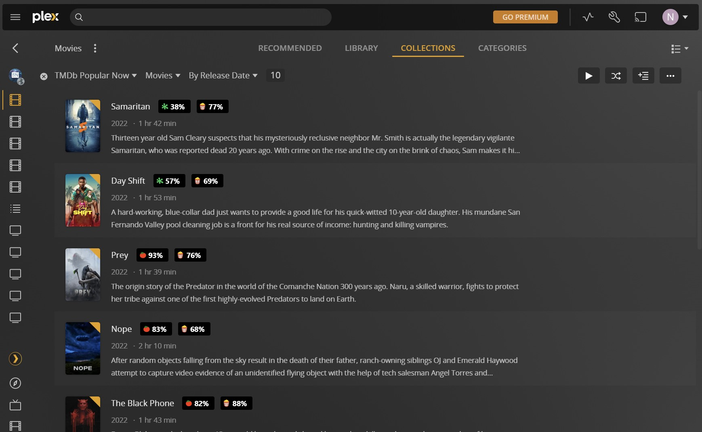

## plex-ui-enhancements-chrome-extension

Show Rotten Tomatoes ratings on library items while browsing the Plex client web UI.

#### Installation

1. [Download the extension source code as a .zip](https://github.com/aralko/plex-ui-enhancements-chrome-extension/archive/refs/heads/main.zip)
2. Extract the files
3. Open chrome://extensions
4. Enable developer mode in the top right of the page
5. Click the load unpacked button and select the folder where you extracted the extension code
